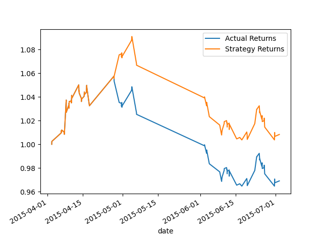
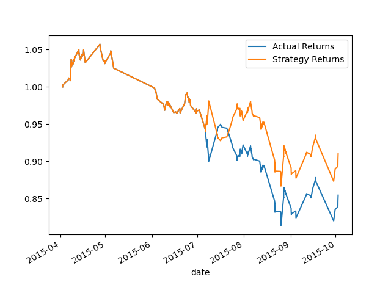
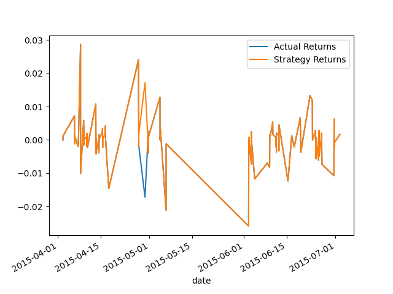
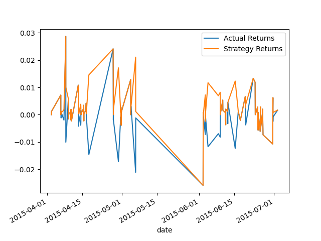

# Module_14_Homework

In the original model, I generated trading signals using short and long-window SMA values, split the data into training and testing datasets, used the SVC classifier model from SKLearn's SVM to fit the training data and make predictions based on the testing data, created a predictions DataFrame that contains columns for “Predicted” values, “Actual Returns”, and “Strategy Returns” and create a cumulative return plot that shows the actual returns vs. the strategy returns. This model serves as a baseline against which to compare the effects of tuning the trading algorithm.

The first month of the data shows that the actual and strategy returns line up perfectly. This could mean that the data is overfitted at this point. The rest of the graph shows that the actual and strategy returns follow a similar trend as after the two splits, they have the same shape. However, the data is higher in the strategy returns for majority of the plot, which is misleading to the user as they may expect more than they will actually get.

In this next model, the data offset of the training data was changed from 3 months to 6 months. This graph shows that the data was more overfitted as the actual and strategy returns both are in line with each other for 3 months before splitting. This also shows that it took longer for the strategy returns to follow the trends of the actual returns as in the original model it took about a week for the data to follow the same pattern but in this model, it took almost a month. 

The model below shows the data after adjusting the short window from 4 to 25 days. The graph is identical to the original graph. This could either mean that adjusting the short window does not affect the returns or that the difference was not big enough to show a difference. I am more inclined to believe that adjusting the short window does not affect the graph as multiplying the short window by over 6 times should show a difference if there were to be one. 

This model shows the data classified using the sklearn classifier, LogisticRegression. As evident in the plot below, this classifier heavily overfitted the data as majority of the data for both actual and strategy returns line up. Although this may seem like a good thing, in machine learning, models can be ‘too good to be true’ and this seems to be the case as only about 1 week in this model is different. 

In this last model, the data shows quite a bit of variance in the actual and strategy returns. However, this seems to be a good model as although it doesn’t line up perfectly, even when the lines diverge, the strategy returns still closely follow the actual returns. 

Therefore, according to the graphs shown above, it is evident that the Adaboost plot is the best model as it is most similar without being overfitted. 
